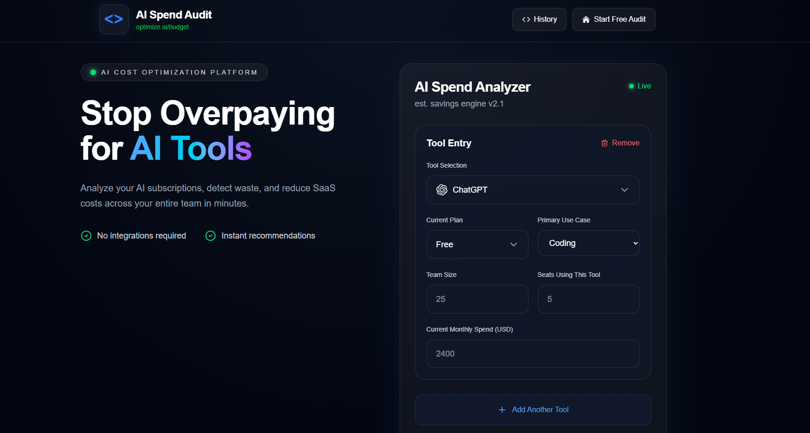
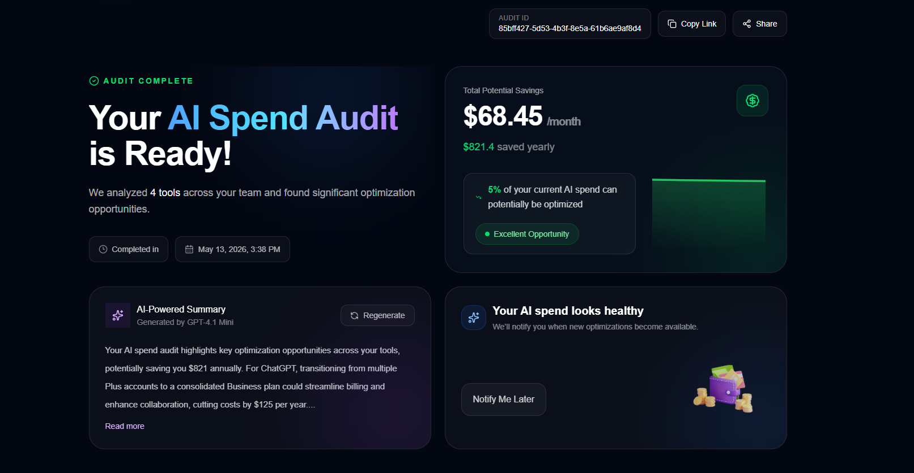
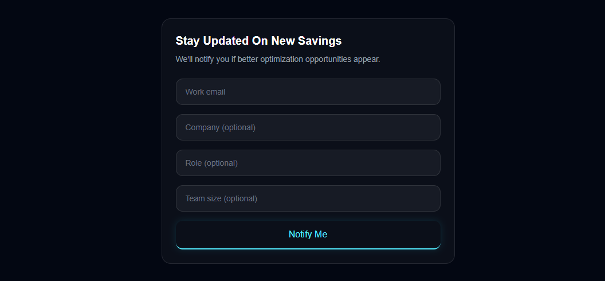

# AI Spend Audit Engine

AI Spend Audit Engine is a full-stack web application that helps startups and small teams identify unnecessary AI subscription costs across tools like ChatGPT, Claude, Cursor, Gemini, GitHub Copilot, and Windsurf.

Users can enter their current AI stack, monthly spend, seats, and use cases to instantly receive optimization recommendations, projected monthly/annual savings, and AI-generated audit summaries. The project is designed as both a cost-optimization tool and a lead-generation product for Credex.

---

# Live Demo

Frontend: https://ai-spend-audit-lilac.vercel.app/

---

## Screenshots

### Home Page



---

### Audit Results Dashboard



---

### Lead Capture + Recommendations



# Demo Video

https://www.loom.com/share/4d478e55df6a4b798d05fafb60b8e8af

---

# Features

- Multi-tool AI spend audit system
- Per-tool optimization recommendations
- Monthly + annual savings calculations
- AI-generated personalized audit summary
- Lead capture with backend storage
- Shareable audit result pages
- Pricing traceability system
- Persistent form state
- Automated audit engine tests with Jest
- CI workflow using GitHub Actions

---

# Supported Tools

- ChatGPT
- Claude
- GitHub Copilot
- Cursor
- Gemini
- Windsurf
- OpenAI API
- Anthropic API

---

# Tech Stack

## Frontend
- React
- Vite
- TailwindCSS

## Backend
- Node.js
- Express

## Database / Services
- Supabase
- Resend API

## Testing
- Jest
- GitHub Actions CI

---

# Quick Start

## 1. Clone Repository

```bash
git clone https://github.com/logicscienc/AI-Spend-Audit.git
cd AI-Spend-Audit
```

---

## 2. Install Frontend Dependencies

```bash
npm install
```

---

## 3. Install Backend Dependencies

```bash
cd backend
npm install
```

---

## 4. Setup Environment Variables

Create `.env` files for frontend and backend.

### Frontend `.env`

```env
VITE_API_BASE=https://ai-spend-audit-zbxt.onrender.com/api
```

### Backend `.env`

```env
SUPABASE_URL=your_url
SUPABASE_ANON_KEY=your_key
OPENAI_API_KEY=your_key
RESEND_API_KEY=your_key
```

---

## 5. Run Frontend

```bash
npm run dev
```

---

## 6. Run Backend

```bash
cd backend
npm run dev
```

---

# Deployment

## Frontend
Deployed on Vercel.

## Backend
Deployed on Render.

---

# Automated Tests

Run tests using:

```bash
npm test
```

Tests cover:
- Plan downgrade recommendations
- Upgrade recommendations
- Efficient spend detection
- Audit engine recommendation logic

---

# Decisions / Trade-offs

## 1. Hardcoded Audit Logic Instead of AI-Based Cost Decisions
I intentionally used deterministic rule-based logic for pricing recommendations because financial recommendations need predictability and explainability.

## 2. Vite Instead of Next.js
I chose Vite for faster local development speed and simpler frontend deployment.

## 3. Separate Backend Deployment
The backend was deployed separately on Render to isolate API logic, email handling, and database operations from the frontend.

## 4. Minimal Authentication
The app does not require login before generating an audit to reduce friction and improve conversion rates.

## 5. Fallback AI Summary Handling
The AI-generated summary includes graceful fallback behavior when the LLM API fails, ensuring the audit result page still works reliably.

---

# Architecture

Detailed architecture documentation is available in:

```bash
ARCHITECTURE.md
```

---

# Pricing Sources

All pricing references are documented in:

```bash
PRICING_DATA.md
```

---

# Tests Documentation

Detailed testing documentation is available in:

```bash
TESTS.md
```

---

# CI/CD

GitHub Actions automatically runs tests on every push to `main`.

Workflow file:

```bash
.github/workflows/ci.yml
```

---

# Author

Anju Kumari

GitHub: https://github.com/logicscienc
LinkedIn: https://www.linkedin.com/in/anjuusingh
